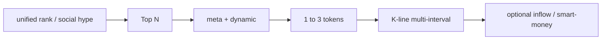

# Market Data and Analysis（市场分析与行情查询）

## Description

**任务说明**：实时价、涨跌幅榜、主流币与山寨热度、ETF/宏观对价格影响的**数据层**支持，以及技术面讨论所需的 K 线、成交量、排行榜等；侧重「查数与排序」，而非代客下单。

**典型线上意图**：BTC 实时价格；领涨领跌山寨币；行情与波动分析；比特币波动原因（结合新闻需 Agent 知识，Skill 提供市场数据）；顶级币智能资金与市场数据（与 `trading-signal` 协同）。

---

## 推荐 Skills 组合

| 角色 | Skill | 用途 |
|------|--------|------|
| 主路径 | `query-token-info` | 代币搜索、价格、成交量、K 线 |
| 主路径 | `crypto-market-rank` | 热门、涨跌幅、社交热度等排行榜 |
| 辅助 | `trading-signal` | 链上聪明钱买卖信号 |
| 辅助 | `binance-tokenized-securities-info` | 代币化美股（RWA）相关数据 |
| 辅助 | `meme-rush` | Meme 币实时追踪 |

---

## Plan（执行计划）

> 与 `Task_upgrade_advice.cn.md` §4 对齐：**先广后窄** — 榜单/主题得候选 Top N → `meta`+`dynamic` 收窄 → 1～3 个标的 **多周期 K 线** → 可选 inflow / smart-money；RWA 单独工作流；宏观用 Agent 补充。

### A. 结构化流水线（DAG）

| 步骤 | 动作 |
|------|------|
| **定场景** | 「扫市场」→ 榜单；「盯单币」→ `search/ai`。 |
| **广撒网** | `unified/rank/list` 或 `social/hype/leaderboard` → 约定 Top N 与排序规则（量、涨幅、热度等）。 |
| **收窄** | 对靠前标的：`meta/info` 去同名错币 → `dynamic/info` 看价量、流动性、持有人。 |
| **深度** | 对最终 1～3 个标的：`dquery` K 线多周期（如 5m/1h/4h），**仅数据非投资建议**。 |
| **交叉验证（可选）** | `inflow/rank`（`tagType=2`）或 `trading-signal`；RWA 用 `binance-tokenized-securities-info`，**不**混用通用 `search`。 |
| **宏观/叙事** | ETF、政策等由 Agent 知识补充；接口提供当日价量背景。 |

### B. 接口级速查

**Host**：Web3 数据多为 `https://web3.binance.com`；具体路径以各 SKILL.md 为准。

1. **代币搜索与元数据（`query-token-info`）**
   - `GET .../bapi/defi/v5/public/wallet-direct/buw/wallet/market/token/search/ai`：参数 `keyword`（必填），可选 `chainIds`、`orderBy`（如 `volume24h`）。
   - `GET .../bapi/defi/v1/public/wallet-direct/buw/wallet/dex/market/token/meta/info/ai`：`chainId` + `contractAddress`。
   - `GET .../bapi/defi/v4/public/wallet-direct/buw/wallet/market/token/dynamic/info/ai`：实时价量、涨跌幅、流动性、持有人等。
   - **K 线**：`GET https://dquery.sintral.io/u-kline/v1/k-line/candles`（`platform`=`bsc`/`eth`/`solana`/`base`，`address`、`interval`、`limit` 等，见 SKILL）。

2. **统一榜单与社交热度（`crypto-market-rank`）**
   - `POST .../bapi/defi/v1/public/wallet-direct/buw/wallet/market/token/pulse/unified/rank/list/ai`：`rankType`（`10` Trending、`11` Top Search、`20` Alpha、`40` Stock）、`chainId`、`period`、`sortBy`、`page`、`size`。
   - `GET .../bapi/defi/v1/public/wallet-direct/buw/wallet/market/token/pulse/social/hype/rank/leaderboard/ai`：`chainId`、`targetLanguage`、`timeRange`（如 `1`=24h）、`sentiment`。

3. **聪明钱流入榜**
   - `POST .../bapi/defi/v1/public/wallet-direct/tracker/wallet/token/inflow/rank/query/ai`：`chainId`、`period`（`5m`/`1h`/`4h`/`24h`）、`tagType`（固定 `2`）。

4. **Meme 专属榜（可选）**
   - `GET .../bapi/defi/v1/public/wallet-direct/buw/wallet/market/token/pulse/exclusive/rank/list/ai?chainId=56`。

5. **聪明钱信号（`trading-signal`）**
   - `POST .../bapi/defi/v1/public/wallet-direct/buw/wallet/web/signal/smart-money/ai`：JSON body `chainId`（`56` / `CT_501`）、`page`、`pageSize`（≤100）。

6. **代币化证券 RWA（`binance-tokenized-securities-info`）**
   - 列表：`GET https://www.binance.com/bapi/defi/v1/public/wallet-direct/buw/wallet/market/token/rwa/stock/detail/list/ai`（可选 `type=1` Ondo）。
   - 其余动态/K 线等按该 SKILL「API 1→6」工作流。

7. **Meme 发射台（`meme-rush`）**
   - `POST .../bapi/defi/v1/public/wallet-direct/buw/wallet/market/token/pulse/rank/list/ai`：`chainId`、`rankType`（`10`/`20`/`30` 阶段）。
   - Topic：`GET .../bapi/defi/v2/public/wallet-direct/buw/wallet/market/token/social-rush/rank/list/ai`：`chainId`、`rankType`（`10`/`20`）、`sort`。

---

## 使用指南

### 结构化要点

- **不要对所有候选拉满 K 线**：只对收窄后的 1～3 个标的做深度，控制延迟与噪音。
- **榜单与信号不一致时**：在回答中并列呈现差异，由用户判断，不强行圆成单一叙事。

### 接口与 Headers

- **Headers**：Web3 技能普遍要求 `Accept-Encoding: identity`、`User-Agent: binance-web3/x.x (Skill)`（版本以 SKILL 为准）。
- **榜单 → 单币**：先用 `unified/rank/list` 拿到 `contractAddress`，再调 `meta/info` 与 `dynamic/info`。
- **BTC/主流现货价**：也可通过 `spot` 的公开 `GET /api/v3/ticker/24hr?symbol=BTCUSDT`（`trading-execution.cn.md` / spot Skill）与 Web3 数据交叉核对。
- **RWA**：普通山寨币不要用 RWA 列表 API；通用代币用 `query-token-info`。
