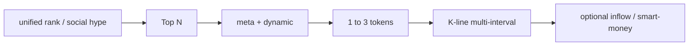

# Market Data and Analysis

## Description

**Task**: Real-time price, gainers/losers, major vs alt heat, ETF/macro **data layer** for price context, plus K-line, volume, ranks for technical discussion—**lookup and ranking**, not placing orders on behalf of users.

**Typical intents**: BTC live price; top alts; volatility analysis; why BTC moved (news needs Agent knowledge; Skills supply market data); smart money and market data (with `trading-signal`).

---

## Recommended Skills

| Role | Skill | Use |
|------|--------|-----|
| Primary | `query-token-info` | Token search, price, volume, K-lines |
| Primary | `crypto-market-rank` | Hot lists, movers, social heat |
| Secondary | `trading-signal` | On-chain smart-money signals |
| Secondary | `binance-tokenized-securities-info` | Tokenized equities (RWA) |
| Secondary | `meme-rush` | Meme token tracking |

---

## Plan

> Aligned with `Task_upgrade_advice.en.md` §4: **broad then narrow** — rank/theme → Top N candidates → `meta`+`dynamic` narrow → **1–3 symbols multi-interval K-lines** → optional inflow / smart-money; RWA separate; macro via Agent.

### A. Structured pipeline (DAG)

| Step | Action |
|------|--------|
| **Scene** | “Scan market” → ranks; “watch one coin” → `search/ai`. |
| **Broad** | `unified/rank/list` or `social/hype/leaderboard` → fix Top N and sort (volume, % change, heat). |
| **Narrow** | For top names: `meta/info` disambiguate wrong tickers → `dynamic/info` price, liquidity, holders. |
| **Depth** | For final 1–3: `dquery` K-lines multi-interval (e.g. 5m/1h/4h), **data only, not advice**. |
| **Cross-check (optional)** | `inflow/rank` (`tagType=2`) or `trading-signal`; RWA via `binance-tokenized-securities-info`, **not** generic `search`. |
| **Macro / narrative** | ETF, policy: Agent knowledge; APIs give same-day price/volume context. |

### B. API quick reference

**Host**: Web3 data often `https://web3.binance.com`; paths per each `SKILL.md`.

1. **Search & metadata (`query-token-info`)**
   - `GET .../bapi/defi/v5/public/wallet-direct/buw/wallet/market/token/search/ai`: `keyword` (required), optional `chainIds`, `orderBy` (e.g. `volume24h`).
   - `GET .../bapi/defi/v1/public/wallet-direct/buw/wallet/dex/market/token/meta/info/ai`: `chainId` + `contractAddress`.
   - `GET .../bapi/defi/v4/public/wallet-direct/buw/wallet/market/token/dynamic/info/ai`: live price/volume, % change, liquidity, holders.
   - **K-line**: `GET https://dquery.sintral.io/u-kline/v1/k-line/candles` (`platform`=`bsc`/`eth`/`solana`/`base`, `address`, `interval`, `limit`, see SKILL).

2. **Unified ranks & social (`crypto-market-rank`)**
   - `POST .../bapi/defi/v1/public/wallet-direct/buw/wallet/market/token/pulse/unified/rank/list/ai`: `rankType` (`10` Trending, `11` Top Search, `20` Alpha, `40` Stock), `chainId`, `period`, `sortBy`, `page`, `size`.
   - `GET .../bapi/defi/v1/public/wallet-direct/buw/wallet/market/token/pulse/social/hype/rank/leaderboard/ai`: `chainId`, `targetLanguage`, `timeRange` (e.g. `1`=24h), `sentiment`.

3. **Smart-money inflow rank**
   - `POST .../bapi/defi/v1/public/wallet-direct/tracker/wallet/token/inflow/rank/query/ai`: `chainId`, `period` (`5m`/`1h`/`4h`/`24h`), `tagType` (fixed `2`).

4. **Meme exclusive list (optional)**
   - `GET .../bapi/defi/v1/public/wallet-direct/buw/wallet/market/token/pulse/exclusive/rank/list/ai?chainId=56`.

5. **Smart-money (`trading-signal`)**
   - `POST .../bapi/defi/v1/public/wallet-direct/buw/wallet/web/signal/smart-money/ai`: body `chainId` (`56` / `CT_501`), `page`, `pageSize` (≤100).

6. **RWA (`binance-tokenized-securities-info`)**
   - List: `GET https://www.binance.com/bapi/defi/v1/public/wallet-direct/buw/wallet/market/token/rwa/stock/detail/list/ai` (optional `type=1` Ondo).
   - Rest per SKILL API 1→6 workflow.

7. **Meme launchpad (`meme-rush`)**
   - `POST .../bapi/defi/v1/public/wallet-direct/buw/wallet/market/token/pulse/rank/list/ai`: `chainId`, `rankType` (`10`/`20`/`30` stage).
   - Topic: `GET .../bapi/defi/v2/public/wallet-direct/buw/wallet/market/token/social-rush/rank/list/ai`: `chainId`, `rankType` (`10`/`20`), `sort`.

### C. Scheduled market pulls (Python / Shell)

To **periodically** refresh ranks, K-lines, or price snapshots (not order placement), **by default** use **Shell + cron** or **Python** to call the §B `GET`/`POST` endpoints (`curl` / `requests`) on your infrastructure. Follow the same **script + scheduler** conventions as **§B.C** in [onchain-signals-and-security.en.md](./onchain-signals-and-security.en.md); thresholds and alerts are implemented in your scripts.

---

## Usage

### Structured notes

- **Do not K-line every candidate**: depth only on 1–3 after narrowing, to limit latency and noise.
- **When rank and signal disagree**: present both; do not force one story.

### Headers & cross-refs

- **Headers**: Web3 Skills often need `Accept-Encoding: identity`, `User-Agent: binance-web3/x.x (Skill)` (version per SKILL).
- **Rank → single token**: get `contractAddress` from `unified/rank/list`, then `meta/info` and `dynamic/info`.
- **BTC / major spot**: can cross-check with public `GET /api/v3/ticker/24hr?symbol=BTCUSDT` (`trading-execution.en.md` / spot).
- **RWA**: do not use RWA list for generic alts; generic tokens → `query-token-info`.
