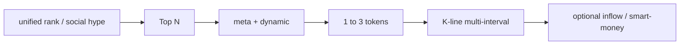

# Market Data and Analysis

## Description

**Task summary**: Real-time prices, gainers/losers, mainstream vs alt heat, ETF/macro **data layer** for price context, and klines/volume/rankings for technical discussion—**query and rank**, not placing orders on behalf of the user.

**Typical intents**: BTC live price; top/bottom alts; volatility analysis; Bitcoin move reasons (news via agent knowledge; skills supply market data); smart money and market data (with `trading-signal`).

---

## Recommended skill mix

| Role | Skill | Use |
|------|--------|-----|
| Primary | `query-token-info` | Token search, price, volume, klines |
| Primary | `crypto-market-rank` | Hot, movers, social heat rankings |
| Secondary | `trading-signal` | On-chain smart-money signals |
| Secondary | `binance-tokenized-securities-info` | Tokenized equities (RWA) |
| Secondary | `meme-rush` | Meme launch tracking |

**binance-skills-hub**: listed skills live under **`skills/binance-web3/<skill-name>/SKILL.md`**; no direct mapping to **`binance-cli`**—spot/USDS orders → `trading-execution.md`.

---

## Plan

> Aligns with `Task_upgrade_advice.md` §4: **broad then narrow** — rankings/themes → Top N → `meta`+`dynamic` → **multi-interval klines** for 1–3 symbols → optional inflow/smart money; RWA separate workflow; macro via agent.

### Status checks and when you cannot proceed

- **Before planning**: Pure market/teaching klines → **usually no** account state; if intent includes “how much can I buy with my account” or execution-tied advice, confirm balance/orders via `account-and-asset-management.md` / `trading-execution.md`.
- **If APIs fail or pair missing**: State gap; ask for symbol/chain/keyword for `search`; **do not** assume fill price or place orders.
- **Cross-task rules**: [Task_upgrade_advice.md](./Task_upgrade_advice.md).

### A. Structured pipeline (DAG)

**Step 0: Prerequisite state check — *MANDATORY***

> **Core skills**: `assets`, `spot`, `derivatives-trading-usds-futures` — use when user ties analysis to account or execution.

1. `assets.getUserAssets`; 2. `getPositions`; 3. `spot.getOrders`.  
> If underfunded: **`fuzzy-intent-and-account-onboarding.md`**.

---

| Step | Action |
|------|--------|
| **Scene** | “Scan market” → rankings; “Watch one coin” → `search/ai`. |
| **Broad** | `unified/rank/list` or `social/hype/leaderboard` → agree Top N and sort (volume, move, heat). |
| **Narrow** | For top names: `meta/info` disambiguate → `dynamic/info` price/volume/liquidity/holders. |
| **Depth** | Final 1–3 symbols: `dquery` klines multi-interval (e.g. 5m/1h/4h)—**data only, not advice**. |
| **Cross-check (opt.)** | `inflow/rank` (`tagType=2`) or `trading-signal`; RWA → `binance-tokenized-securities-info`, **not** generic `search`. |
| **Macro/narrative** | ETF/policy etc. from agent; APIs give same-day price/volume context. |

### B. Endpoint quick reference

**Host**: Web3 data mostly `https://web3.binance.com`; paths per each SKILL.md.

1. **`query-token-info`**: `search/ai`, `meta/info`, `dynamic/info`; klines `GET https://dquery.sintral.io/u-kline/v1/k-line/candles` (params per SKILL).
2. **`crypto-market-rank`**: `POST .../unified/rank/list/ai`; `GET .../social/hype/rank/leaderboard/ai`.
3. **Smart-money inflow**: `POST .../tracker/wallet/token/inflow/rank/query/ai` (`tagType=2`).
4. **Meme exclusive (opt.)**: `GET .../exclusive/rank/list/ai?chainId=56`.
5. **`trading-signal`**: `POST .../smart-money/ai` (`chainId`, `page`, `pageSize` ≤100).
6. **RWA (`binance-tokenized-securities-info`)**: stock list and workflow per SKILL.
7. **`meme-rush`**: `POST .../pulse/rank/list/ai`; topic `GET .../social-rush/rank/list/ai`.

### C. Scheduled market pulls (Python / Shell)

For **scheduled** rank/klines/price snapshots (no orders), default to user env **Shell + cron** or **Python** polling §B `GET`/`POST` (`curl` / `requests`), same convention as [onchain-signals-and-security.md](./onchain-signals-and-security.md) **§B.C**; thresholds/alerts in user script.

---

## Usage guide

- **Do not kline every candidate**: depth only on 1–3 symbols after narrowing.
- **When rank vs signal disagree**: present both; do not force one story.
- **Headers**: Web3 skills typically `Accept-Encoding: identity`, `User-Agent: binance-web3/x.x (Skill)`.
- **Rank → token**: get `contractAddress` from `unified/rank/list`, then `meta`/`dynamic`.
- **BTC spot check**: optional `GET /api/v3/ticker/24hr?symbol=BTCUSDT` (`spot`) vs Web3 cross-check.
- **RWA**: do not use RWA list API for generic alts.
