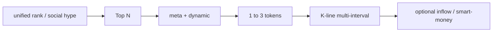

# Market Data and Analysis

## Description

**Task summary**: Real-time prices, gainers/losers, mainstream vs alt heat, ETF/macro **data layer** for price context, and klines/volume/rankings for technical discussion—**query and rank**, not placing orders on behalf of the user.

**Typical intents**: BTC live price; top/bottom alts; volatility analysis; Bitcoin move reasons (news via agent knowledge; skills supply market data); smart money and market data (with `trading-signal`).

**Hub**: Web3 skills by **`name`** (e.g. `query-token-info`, `crypto-market-rank`, `trading-signal`, `meme-rush`, `binance-tokenized-securities-info`); no dedicated **`binance-cli`** lane here—spot/USDS orders → [trading-execution.md](./trading-execution.md).

## Plan

### Step 1 — Account state (*MANDATORY*, always first)

**First** decide whether the user only needs **public** market data (no account tie). If they mention **buying / sizing / “with my balance” / execution**, you **must** check **`assets`** (and **`spot`** / derivatives as needed) **before** giving amounts or implying they can trade.

- **If funds cannot support the implied action**: **Proactively say so** (e.g. insufficient available, need transfer from Funding) and point to [account-and-asset-management.md](./account-and-asset-management.md) / [trading-execution.md](./trading-execution.md) / **[fuzzy-intent-and-account-onboarding.md](./fuzzy-intent-and-account-onboarding.md)**—**do not** give executable size as if cash were there.

1. When account-tied: `assets.getUserAssets`; 2. `derivatives-trading-usds-futures.getPositions` if relevant; 3. `spot.getOrders` if relevant.  
> If underfunded: **[fuzzy-intent-and-account-onboarding.md](./fuzzy-intent-and-account-onboarding.md)**.

> Aligns with `task-upgrade-advice.md` §4: **broad then narrow** — rankings/themes → Top N → `meta`+`dynamic` → **multi-interval klines** for 1–3 symbols → optional inflow/smart money; RWA separate workflow; macro via agent.

### Status checks and when you cannot proceed

- **Before planning**: Pure market/teaching klines → **usually no** account state; if intent includes “how much can I buy with my account” or execution-tied advice, confirm balance/orders via [account-and-asset-management.md](./account-and-asset-management.md) / [trading-execution.md](./trading-execution.md).
- **If APIs fail or pair missing**: State gap; ask for symbol/chain/keyword for `search`; **do not** assume fill price or place orders.
- **Cross-task rules**: [task-upgrade-advice.md](./task-upgrade-advice.md).

### A. Structured pipeline (DAG)

| Step | Action |
|------|--------|
| **Scene** | “Scan market” → rankings; “Watch one coin” → `search/ai`. |
| **Broad** | `unified/rank/list` or `social/hype/leaderboard` → agree Top N and sort (volume, move, heat). |
| **Narrow** | For top names: `meta/info` disambiguate → `dynamic/info` price/volume/liquidity/holders. |
| **Depth** | Final 1–3 symbols: `dquery` klines multi-interval (e.g. 5m/1h/4h)—**data only, not advice**. |
| **Cross-check (opt.)** | `inflow/rank` (`tagType=2`) or `trading-signal`; RWA → `binance-tokenized-securities-info`, **not** generic `search`. |
| **Macro/narrative** | ETF/policy etc. from agent; APIs give same-day price/volume context. |

### B. Endpoint quick reference

**Host**: Web3 data mostly `https://web3.binance.com`; paths per each Web3 skill’s §B (by **`name`**).

1. **`query-token-info`**: `search/ai`, `meta/info`, `dynamic/info`; klines `GET https://dquery.sintral.io/u-kline/v1/k-line/candles` (params per **`query-token-info`** skill).
2. **`crypto-market-rank`**: `POST .../unified/rank/list/ai`; `GET .../social/hype/rank/leaderboard/ai`.
3. **Smart-money inflow**: `POST .../tracker/wallet/token/inflow/rank/query/ai` (`tagType=2`).
4. **Meme exclusive (opt.)**: `GET .../exclusive/rank/list/ai?chainId=56`.
5. **`trading-signal`**: `POST .../smart-money/ai` (`chainId`, `page`, `pageSize` ≤100).
6. **RWA (`binance-tokenized-securities-info`)**: stock list and workflow per **`binance-tokenized-securities-info`** skill.
7. **`meme-rush`**: `POST .../pulse/rank/list/ai`; topic `GET .../social-rush/rank/list/ai`.

### C. Scheduled market pulls (Python / Shell)

For **scheduled** rank/klines/price snapshots (no orders), default to user env **Shell + cron** or **Python** polling §B `GET`/`POST` (`curl` / `requests`), same convention as [onchain-signals-and-security.md](./onchain-signals-and-security.md) **§B.C**; thresholds/alerts in user script.
